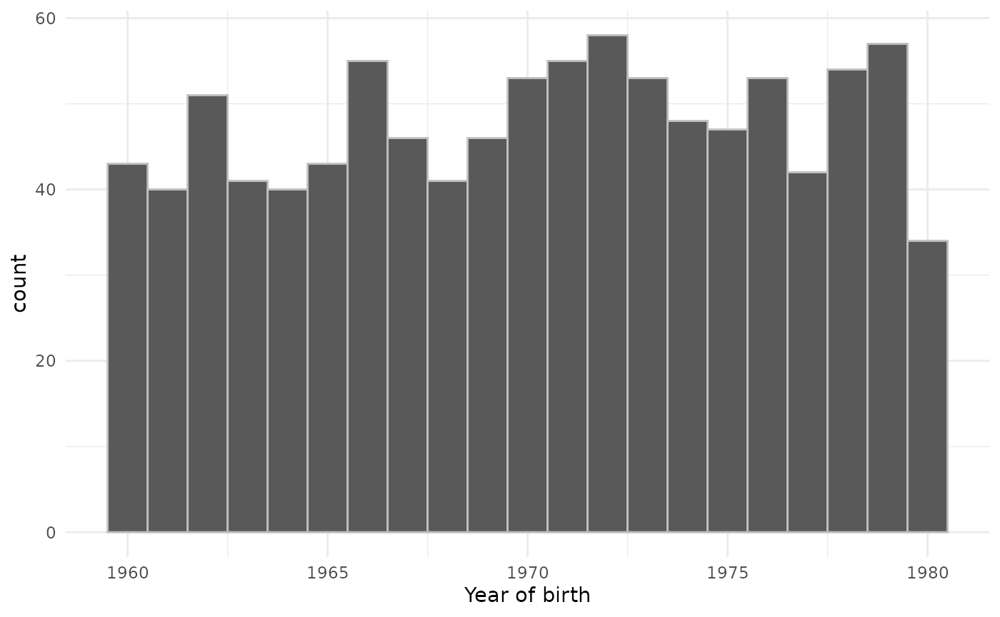

# Creating synthetic clinical tables

The omock package provides functionality to quickly create a cdm
reference containing synthetic data based on population settings
specified by the user.

First, let’s load packages required for this vignette.

``` r
library(omock)
library(dplyr)
library(ggplot2)
```

Now, in three lines of code, we can create a cdm reference with a person
and observation period table for 1000 people.

``` r
cdm <- emptyCdmReference(cdmName = "synthetic cdm") |>
  mockPerson(nPerson = 1000) |>
  mockObservationPeriod()

cdm
#> 
#> ── # OMOP CDM reference (local) of synthetic cdm ───────────────────────────────
#> • omop tables: observation_period, person
#> • cohort tables: -
#> • achilles tables: -
#> • other tables: -

cdm$person |> glimpse()
#> Rows: 1,000
#> Columns: 18
#> $ person_id                   <int> 1, 2, 3, 4, 5, 6, 7, 8, 9, 10, 11, 12, 13,…
#> $ gender_concept_id           <int> 8532, 8532, 8532, 8507, 8532, 8507, 8507, …
#> $ year_of_birth               <int> 1991, 1998, 1981, 1956, 1985, 1961, 1982, …
#> $ month_of_birth              <int> 10, 11, 5, 2, 2, 6, 1, 3, 2, 5, 3, 6, 2, 1…
#> $ day_of_birth                <int> 15, 24, 22, 23, 9, 4, 3, 22, 28, 3, 26, 4,…
#> $ race_concept_id             <int> NA, NA, NA, NA, NA, NA, NA, NA, NA, NA, NA…
#> $ ethnicity_concept_id        <int> NA, NA, NA, NA, NA, NA, NA, NA, NA, NA, NA…
#> $ birth_datetime              <dttm> NA, NA, NA, NA, NA, NA, NA, NA, NA, NA, N…
#> $ location_id                 <int> NA, NA, NA, NA, NA, NA, NA, NA, NA, NA, NA…
#> $ provider_id                 <int> NA, NA, NA, NA, NA, NA, NA, NA, NA, NA, NA…
#> $ care_site_id                <int> NA, NA, NA, NA, NA, NA, NA, NA, NA, NA, NA…
#> $ person_source_value         <chr> NA, NA, NA, NA, NA, NA, NA, NA, NA, NA, NA…
#> $ gender_source_value         <chr> NA, NA, NA, NA, NA, NA, NA, NA, NA, NA, NA…
#> $ gender_source_concept_id    <int> NA, NA, NA, NA, NA, NA, NA, NA, NA, NA, NA…
#> $ race_source_value           <chr> NA, NA, NA, NA, NA, NA, NA, NA, NA, NA, NA…
#> $ race_source_concept_id      <int> NA, NA, NA, NA, NA, NA, NA, NA, NA, NA, NA…
#> $ ethnicity_source_value      <chr> NA, NA, NA, NA, NA, NA, NA, NA, NA, NA, NA…
#> $ ethnicity_source_concept_id <int> NA, NA, NA, NA, NA, NA, NA, NA, NA, NA, NA…

cdm$observation_period |> glimpse()
#> Rows: 1,000
#> Columns: 5
#> $ person_id                     <int> 1, 2, 3, 4, 5, 6, 7, 8, 9, 10, 11, 12, 1…
#> $ observation_period_start_date <date> 2007-03-18, 2005-12-23, 2016-07-23, 201…
#> $ observation_period_end_date   <date> 2018-05-20, 2014-02-14, 2018-08-23, 201…
#> $ observation_period_id         <int> 1, 2, 3, 4, 5, 6, 7, 8, 9, 10, 11, 12, 1…
#> $ period_type_concept_id        <int> 0, 0, 0, 0, 0, 0, 0, 0, 0, 0, 0, 0, 0, 0…
```

We can add further requirements around the population we create. For
example we can require that they were born between 1960 and 1980 like
so.

``` r
cdm <- emptyCdmReference(cdmName = "synthetic cdm") |>
  mockPerson(
    nPerson = 1000,
    birthRange = as.Date(c("1960-01-01", "1980-12-31"))
  ) |>
  mockObservationPeriod()
```

``` r
cdm$person |>
  collect() |>
  ggplot() +
  geom_histogram(aes(as.integer(year_of_birth)),
    binwidth = 1, colour = "grey"
  ) +
  theme_minimal() +
  xlab("Year of birth")
```


